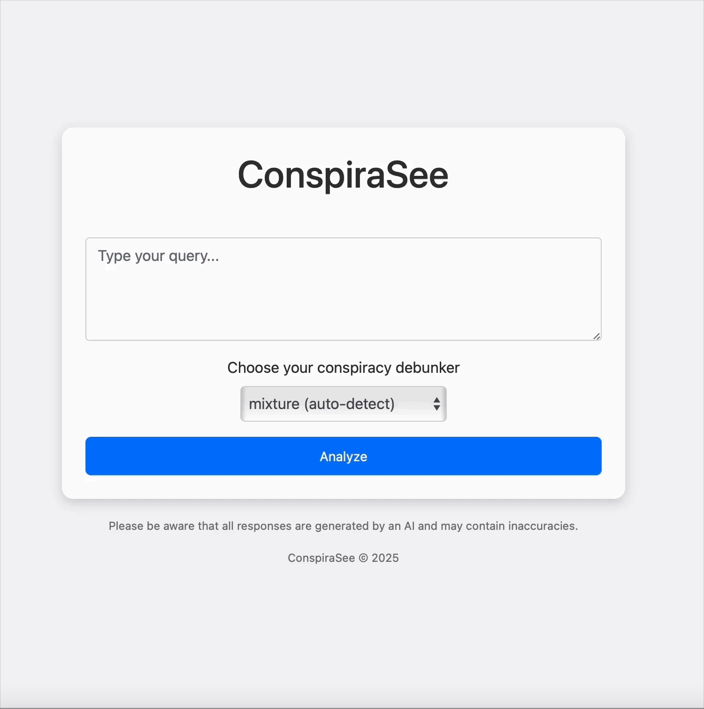

# ConspiraSee

ConspiraSee is an automated text analysis tool designed to detect, classify, and respond to submissions related to conspiracies, misinformation, and related content.  Designed for Reddit posts, it leverages a team of specialized bots and an AI agent to analyze and counter misinformation in real time.

This project was, originally, made in our participation of [BrickHack 2025](https://brickhack11.devpost.com).

## Table of Contents
- [Problem](#problem)
- [Why it Works](#why-it-works)
- [Demo](#demo)
- [Features](#features)
- [Datasets](#datasets)
- [Usage](#usage)
  - [CLI Mode](#cli-mode)
  - [Agentic Mode](#agentic-mode)
  - [Web Interface](#web-interface)
- [Bot Overview](#bot-overview)
- [License](#license)

#### Keywords:
Responsible AI, Conspiracy Theories, Misinformation, Disinformation, Counter-Narratives, Generative AI

## Problem:  
Modern social media—and even our own thinking—often forces us into binary choices: good/bad, true/false. This oversimplification fuels polarization and creates a perfect playground for conspiracy theories.
- Polarization Pitfall: Conspiracies thrive in echo chambers, amplified by algorithms that favor fringe ideas.
- Binary Traps: Like social media’s dualistic framing, conspiracy theories set up strict divisions: true vs. false, us vs. them.
- Backfiring Fact-Checks: Traditional fact-checking can sometimes backfire, reinforcing beliefs by being seen as attacks on deeply held ideas.

## Why it works:
ConspiraSee tackles polarization without resorting to censorship—providing thoughtful, nuanced counterpoints that encourage critical thinking rather than shutting down conversation.

## Demo

__CLI Mode__
<p>

</p>

__Web Interface__
<p>

</p>

__Agentic Mode__
<p>

</p>

## Features
- Reddit Agent: Seamlessly authenticate using PRAW to stream and process posts from Reddit asynchronously.
- Expert Bot Selection: Automatically selects one of several specialized bots based on prompt classification.
- Multiple Modes:
  - CLI Mode: Analyze individual posts via command-line arguments.
  - Agentic Mode: Continuously stream and process submissions from target subreddits asynchronously.
  - Web Interface: Enjoy an interactive Flask-based website to check and generate responses.
- Exponential Backoff: Robust error handling to gracefully manage rate limits and network hiccups.
- Ollama Model Integration: Enhance prompt classification and bot response accuracy with an external model.

## Usage

### CLI Mode

Run the application in CLI mode to analyze a single post by providing command-line arguments:

```ConspiraSee --title "Your post title" --body "Your post body content" --bot mixture```

#### Arguments:
- --title: The title of the claim.
- --body: (Optional) The body/content of the claim.
- --title-only: Use this flag to analyze only the title.
- --bot: Specify which bot to use. Options include:
  - MythBustingScientist
  - SourceDissector
  - HistoricalEcho
  - ParodyAnalogy
  - SocraticQuestion

### Agentic Mode

This mode streams submissions from target subreddits (e.g., /r/conspiracy) and processes them automatically.

Note: You’ll need to provide your Reddit username and password to enable comment posting.

### Web Interface

Enjoy our Flask-powered web interface to interactively:
- Analyze Posts: Check if a post is conspiratorial.
- Generate Responses: Get a creative counter-response from the right bot.

Simply enter the text into the form, submit, and watch ConspiraSee in action!

## Installation & Setup Instructions

Follow these steps to get ConspiraSee up and running:

  1. Clone the Repository
  ```git clone https://github.com/yourusername/ConspiraSee.git```

  2. Install Dependencies
  Install the required Python packages using the provided requirements.txt:
  ```pip install -r requirements.txt```

  3. Configuration Details
  ConspiraSee uses several environment variables for configuration, especially for Reddit API access. Create a .env file in the root directory with the following content:

  **Reddit API Credentials**
  REDDIT_CLIENT_ID=your_reddit_client_id
  REDDIT_CLIENT_SECRET=your_reddit_client_secret
  REDDIT_USERNAME=your_reddit_username
  REDDIT_PASSWORD=your_reddit_password
  REDDIT_USER_AGENT=ConspiraSeeBot/0.1 by your_reddit_username

  **Other configurations**
  FLASK_ENV=development
  SECRET_KEY=your_secret_key_here

  Replace the placeholder values with your actual credentials and desired settings.

  4. Run the Application
  Depending on your usage, you can run the application in different modes:
  
    A. CLI Mode:
      To analyze a single post, use: ```ConspiraSee --title "Your post title" --body "Your post body content" --bot MythBustingScientist```.
    
    B. Agentic Mode:
      This mode streams posts from target subreddits. Make sure your Reddit credentials are correctly set in the .env file, then run: ```ConspiraSee --mode agentic```.
    
    C. Web Interface:
      Start the Flask server to access the interactive web interface: ```ConspiraSee --mode web```.
      Then, open your browser and navigate to 127.0.0.1 to begin using the web interface.

  By following these steps, you should have ConspiraSee installed, configured, and ready for analysis. Enjoy exploring the project!

## Bot Overview

Our team of specialized bots is here to deliver tailored responses:
- MythBustingScientistBot: Debunks myths with factual, science-based counterarguments.
- SourceDissectorBot: Investigates and verifies the credibility of cited sources.
- HistoricalEchoBot: Provides historical context and perspective on current claims.
- ParodyAnalogyBot: Uses humor and creative analogies to satirize content.
- SocraticQuestionBot: Engages with probing questions to spark critical thinking.

Each bot comes with a default model (currently “mistral”) to ensure sharp and thoughtful responses based on your post’s title and content.

### Datasets
1. [Twitter15](https://aclanthology.org/P17-1066/)
2. [Twitter16](https://aclanthology.org/P17-1066/)

## License

This project is licensed under the [MIT License](/LICENSE).

##### Disclaimer: This project is intended for research and educational purposes only. Users should ensure compliance with Reddit’s API terms of service and community guidelines when deploying automated bots.
